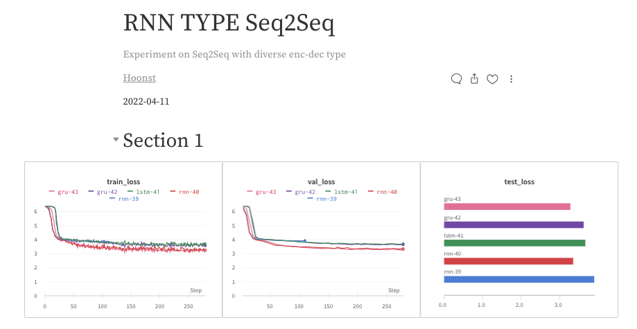

# papagomt
papago deep learning test

* Task
Mapping Function from an input sequence of integers ("source") to an output sequence of integers ("target") using training dataset
숫자 데이터 셋을 통한 Mapping으로 보이지만, 기업의 특성 상 번역 Task / Generation에 대한 Task로 예상된다.

따라서 Generation으로 접근해야 하며, 이미 각 토큰에 대한 Index로 Sequence가 표현되어 있다고 보면, 오히려 파파고에서 정제를 해준 데이터라고 보면 된다.

Seq2Seq에 대해서 직접 구현을 해본 적은 없기 때문에, 
> https://github.com/bentrevett/pytorch-seq2seq
가장 이해하기 쉽게 느껴졌던 해당 Jupyter Notebook을 Trainer안에 포함하는 과정으로 진행했다.

## 절차
1. **Sequence Preprocess**
    * Source(src)와 Target(tgt)에 대해 길이 분석을 통해 하나의 언어가 다른 언어로 번역이 되는 모습을 상상할 수 있었다. 
    Token 개수가 다르기에, Vocab Dictionary를 source와 target에 대하여 각각 구성하여 해당 데이터 셋들에 대하여 숫자를 재할당해주었다.
    * Token의 인덱스를 각기 3부터 시작하여 재할당을 하였으며, 그 이유는 0,1,2는 각기 <SOS_Token>, <EOS_Token>, <PAD_Token>으로 정해줘야 하기 때문이다.
    * src와 tgt에 대한 Max Length를 설정해주어야 했기에, 각 데이터에서 가장 큰 Sequence를 최대 길이로 정했다. 하지만 해당 부분은 분포를 살펴보고 평균과 최대 길이 사이의 값으로 설정하는 것이 학습 과정에서 더 좋을 결과를 나타낼 것 같다.
    * 모든 Sequence는 'batch_first=True'로 설정하여 보는 것이 눈에 더 익으나, RNN 모델들은 'batch_first=False'를 선호하는 것 같았다. 따라서 batch_first를 True로 변환한 사례를 만들어보고자 했으나, 차원이 pytorch document에서 기술한 대로 return이 되지 않아 해결하기에 너무 많은 시간이 소요될 것이라 예상이 되어 스킵하였다.

2. **Model 선정**  
    * RNN Based  
        * RNN 계열의 기본 RNN / LSTM / GRU를 사용하여 Seq2Seq의 Encoder / Decoder로 활용하였다.  
        * 세 모델 구조는 모두 n_layers(층수) / bidirectional(양방향 여부) 등 공통적인 파라미터를 공유하고 있었기에, Seq2Seq 안에 모델들을 바꿔가며 실험할 수 있도록 디자인하였다.   
        * 다른 파라미터들을 모델의 Output에 큰 영향을 주지 않았지만, Bidirectional은 Output 값에 대한 후처리가 다소 시간이 소요될 것 같아 스킵하였다.  
        * RNN 기반 모델들에 대하여 Attention을 추가하여 모델을 구성하였다.이 중 LSTM은 디버깅에 필요한 시간이 부족하여 성능을 나타내지 못했다.

    * Transformer  
        * Transformer를 활용해 Seq2Seq을 진행하였으며 Loss 감소와 빠른 속도 면에서 가장 좋은 성능을 보여주었다.  
        * Transformer를 bentrevett의 Notebook을 참고하여 구성하여 Notebook 내에서 훈련하고 Metric의 값을 도출했다.  
        * 하지만 디자인한 Trainer에 포함하는 과정에서 파악하기엔 시간이 부족했던 원인으로 계속 동일한 값이 나오게 되어 예측에 실패하였다.  

3. **Trainer 구성 특징**
    * Trainer는 같은 연구실 인원 @김탁영 (https://github.com/youngerous) 의 Repository를 참고
    * Trainer는 Pytorch Lightning의 Trainer와 유사한 기능을 하며, 여기에 평소 애용하는 Wandb를 통해 실험 결과 도출

4. **폴더 구조**
```bash
├── code : 훈련 코드
│   ├── config.py
│   ├── dataset.py
│   ├── main.py
│   ├── model.py
│   ├── trainer.py
│   ├── transformer.py
│   └── utils.py
├── data : 제공 데이터
│   ├── README.md
│   ├── train_source.txt
│   ├── train_target.txt
│   ├── test_source.txt
│   └── test_target.txt
├── scripts : 훈련 목적에 따른 Script
│   ├── train_rnn.sh       
│   ├── train_rnn_att.sh
│   ├── train_lstm.sh
│   ├── train_lstm_att.sh
│   ├── train_gru.sh
│   ├── train_gru_att.sh
│   └── train_transformer.sh
├── scripts
│   └── checkpoints
└── notebooks
    └── Transformer_Notebook.ipynb
``` 

5. **Metric 선정**  
    * Metric으로는 BLEU Score와 Rouge Score를 선정하였으며, 빠른 구현을 위하여 pytorch-ignite의 기본 세팅을 통해 Metric들을 구성하였다.   

6. **실험 결과**  
* 2020.04.10 Paperswithcode 기준 NMT Task에 대한 BLEU Score는 다음과 같다.  

Dataset | Model | BLEU |
-----------------| ---------- | -----|
WMT2014 English-German | Transformer Cycle | 35.14 |
WMT2015 English-German | PS-KD | 30.00 |
WMT2016 English-German | MADL | 40.68 |

대부분의 모델들이 30~40 수준의 BLEU Score를 달성하고 있다.  

* 제공 데이터 셋에 대한 BLEU / ROUGE Score (Batch Size: 128 / Epoch 25)
* (Random Seed에 대한 고정을 완벽하게 했다고 생각했으나, 어디선가 문제가 발생하여 실험마다 결과가 약간 상이할 수 있다.)
* RNN의 실험이 진행 중이라 실험 종료 시 업데이트 진행
* Transformer 만이 BLEU / ROUGE Score가 정상적으로 나타나며, RNN 계열의 모델은 모두 처참한 결과

Model | Transformer | RNN | RNN ATT | LSTM | LSTM ATT | GRU | GRU ATT |
---------- | --------- | ------- | ------- | ------- | ------- | ------- | ------- |
BLEU      | 0.416 | 0.023 | 0.024 | x | x | x | x |
ROUGE-L-P | 0.418 | 0.089 | 0.088 | x | x | x | x |
ROUGE-L-R | 0.446 | 0.035 | 0.035 | x | x | x | x |
ROUGE-L-F | 0.446 | 0.035 | 0.035 | x | x | x | x |
ROUGE-2-P | 0.255 | 0.072 | 0.071 | x | x | x | x |
ROUGE-2-R | 0.275 | 0.026 | 0.026 | x | x | x | x |
ROUGE-2-F | 0.275 | 0.026 | 0.026 | x | x | x | x |

* RNN 계열의 모델: RNN / LSTM / GRU는 모두 유사한 (저조한) 성능
* 하지만 Loss 관점에서는 감소하는 추세를 볼 수 있었다.


7. **Todo**
- [ ] Bidirectional / N-layers에 대한 실험이 가능하도록 수정
- [ ] Transformer가 Trainer 내에서 작동하지 않는 이유 탐색
- [ ] docs 관리
- [ ] RNN 계열의 성능이 저조한 이유를 실제 Prediction과 Answer의 비교를 통해 파악 필요
- [ ] 현재 Train.sh 로 Test가 한번에 진행이 되기 때문에 기능 분리가 필요
- [ ] 더 효율적인 데이터 처리를 위한 Packed Sequence 적용
- [ ] Greedy Decoding 대신 Beam Search 사용

8. **Reference**
- https://github.com/bentrevett/pytorch-seq2seq
- https://github.com/youngerous/transformer/
- https://github.com/IBM/pytorch-seq2seq/ : Topk Decoder
- Packed Sequence
    -  https://simonjisu.github.io/nlp/2018/07/05/packedsequence.html
    - https://gist.github.com/HarshTrivedi/f4e7293e941b17d19058f6fb90ab0fec
    - https://suzyahyah.github.io/pytorch/2019/07/01/DataLoader-Pad-Pack-Sequence.html
- https://github.com/threelittlemonkeys/seq2seq-pytorch
- https://github.com/sooftware/seq2seq
- https://scale.com/blog/pytorch-improvements

8. 과제 느낀점
개념적으로는 간단한 Task이지만 직접 구현 및 Trainer 구성이 난이도가 높았다.  
파파고에 어울리는 과제이며, 더 많은 것을 해보고 회사에 보여주고 싶었지만 아쉽게도  
익숙하지 못한 과제여서 보여주지 못한 것이 많았다. 

하지만 Scratch 부터 한땀한땀 모델을 구성하는 것이 오랜만이라 재밌었으며, 앞으로도 기존에 짜여져있는 모델을 사용하는 대신
직접 구성하는 연습을 해봐야겠다는 생각이 들었다.

과제 제출하겠습니다.

감사합니다. 

